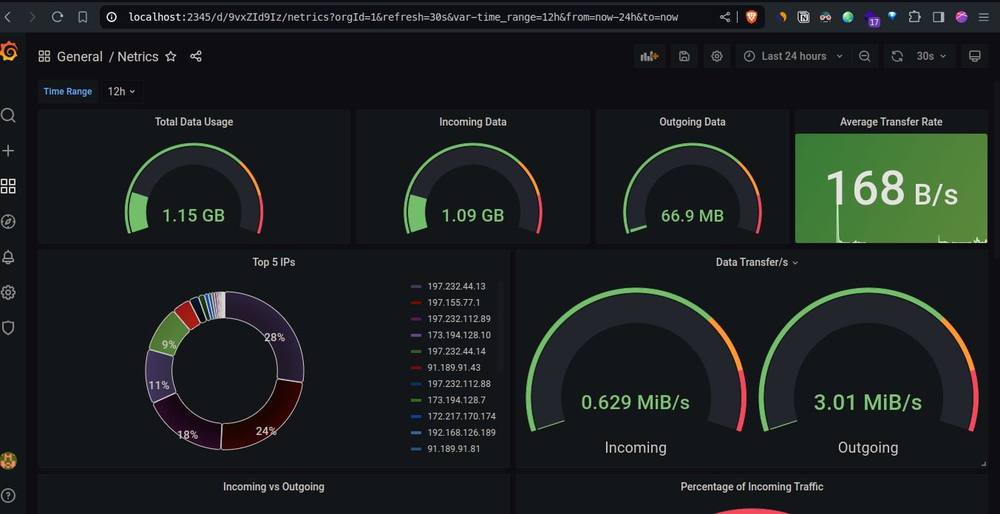

# Netrics

Netrics is a simple network monitoring tool that monitors the network and provides a simple web interface to view the status of the network using Grafana.

## Notice

>   The docker-compose file uses the `network_mode: host` to access the host network. Meaning it wont work on windows and mac. You can use the `bridge` network mode and expose the ports to the host machine. or if you have a way to access the host network interface from the container you can feel free to create a pull request.

## Installation

1. Clone the repository
2. Run `docker compose up -d --build` to start the services

## Usage

1. Open your browser and go to `http://localhost:2345`
2. Login with the default credentials `admin:admin`
3. Add a new prometheus datasource with the url `http://localhost:9123`
4. run save and test
5. Import the dashboard from `grafana/dashboard.json`
6. Enjoy monitoring your network

## License

This project is licensed under the MIT License - see the [LICENSE](LICENSE) file for details
